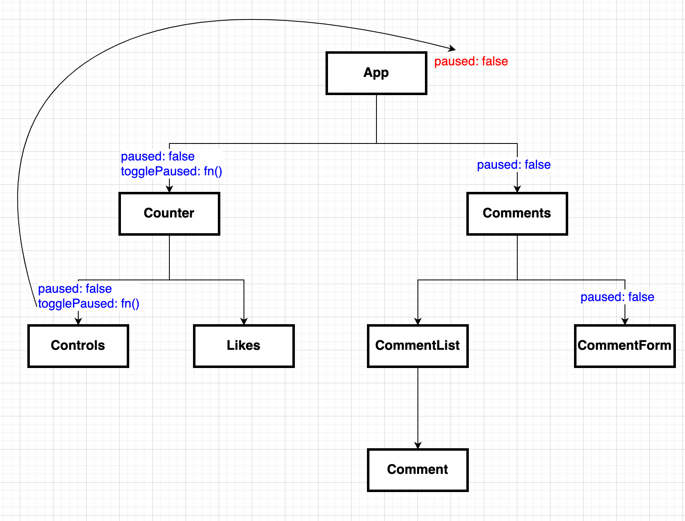
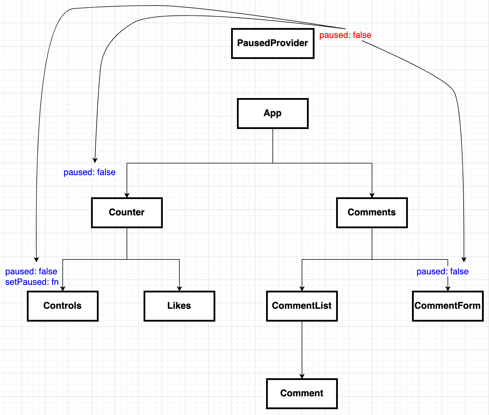

# Advanced Hooks

## useContext

So far, we've learned one way to share data between components: by passing that
data down as a **prop**.

React has another system for sharing data between components: the
[Context][react context] system.

The context system is useful for any state that would be considered 'global' in
an application. Common examples of global data are things like:

- A logged in user
- A theme for styling components (light mode/dark mode)
- User preferences (language; localization; etc)

Working with context means we can treat the way data is shared in our
component hierarchy a bit differently. Here's an example of how we might
share one piece of data from the `App` component to other components
in our component hierarchy:



```js
/*
- App
  - Counter
    - Controls
    - Likes
  - Comments
    - CommentList
      - Comment
    - CommentForm
*/
```

Notice that the `paused` variable is being passed to four components:

- `Counter`
- `Controls`
- `Comments`
- `CommentForm`

In some cases, we are only passing the prop down so that it can be passed down
another level to some child component. If we were to use context instead,
we'd end up with something more like this:



Notice we now have a new component, `PausedProvider`, which is responsible for
the `paused` state. Instead of passing it as a prop to the components that need
it, those components **subscribe** to our context in the `PausedProvider`
component.

That means whenever `setPaused` is called, all the components that are
subscribed to that value will be notified, and can re-render.

### Implementing Context

In order to implement context, we'll need to set up two things:

- a new Context object
- a Context Provider

Let's organize this code in a new file.

```js
// src/context/paused.js
import React, { createContext, useState } from "react";

// create the context object
const PausedContext = createContext();

// create the context provider
function PausedProvider({ children }) {
  const [paused, setPaused] = useState(false);

  // provide a value to the context subscribers
  const value = [paused, setPaused];
  return <PausedProvider value={value}>{children}</PausedProvider>;
}

// export
export { PausedContext, PausedProvider };
```

Now we can use the value from our `PausedContext` in any component, so long as
the `PausedProvider` is rendered higher up in our component tree. All we need to
do to subscribe to that context in a component is call the `useContext` hook:

```js
import React, { useContext } from "react";
import ReactDOM from "react-dom";
import { PausedProvider, PausedContext } from "./context/PausedContext";

function GrandChild() {
  // subscribe the value from context (not props!)
  const [paused, setPaused] = useContext(PausedContext);

  return (
    <div>
      <h3>GrandChild</h3>
      <button onClick={() => setPaused(!paused)}>
        Paused: {paused ? "yep" : "nope"}
      </button>
    </div>
  );
}

function Child() {
  // subscribe the value from context (not props!)
  const [paused] = useContext(PausedContext);

  return (
    <div>
      <h2>Child</h2>
      <p>Paused: {paused ? "yep" : "nope"}</p>
      <GrandChild />
    </div>
  );
}

function App() {
  return (
    <div>
      <h1>App</h1>
      <Child />
    </div>
  );
}

ReactDOM.render(
  <PausedProvider>
    <App />
  </PausedProvider>,
  document.getElementById("root")
);
```

In this example, the `GrandChild` component is subscribing to the
`PausedContext` by calling `useContext`, and so any time the value changes,
`GrandChild` will re-render.

## useRef Hook

### Accessing DOM Elements

One common use case for the `useRef` hook is to gain access to the actual DOM
elements being created by our React components. In general, we want to give
React control over the DOM based on the JSX that is returned by our components.
However, sometimes it is also useful to gain access to the actual DOM elements
for a few uses outside of the React rendering cycle, such as:

- using a third-party library that needs access to a DOM element
- accessing input values in a non-controlled form
- setting focus on an element
- measuring the size of a DOM element
- working with a `<canvas>` or `<video>` element

To use a ref on a DOM element, we first create the ref using the `useRef` hook:

```js
function Box() {
  const elementRef = useRef();

  return (
    <div>
      <h1>Box</h1>
      <button>Measure</button>
    </div>
  );
}
```

Then, we can attach the ref to a DOM element by adding a special `ref` attribute to our JSX:

```js
function Box() {
  const elementRef = useRef();

  return (
    <div ref={elementRef}>
      <h1>Box</h1>
      <button>Measure</button>
    </div>
  );
}
```

Now, we can access information about that DOM element in our component:

```js
function Box() {
  const elementRef = useRef();

  function handleMeasureClick() {
    const div = elementRef.current;
    console.log("Measurements: ", div.getBoundingClientRect());
  }

  return (
    <div ref={elementRef}>
      <h1>Box</h1>
      <button onClick={handleMeasureClick}>Measure</button>
    </div>
  );
}
```

### useRef and Ref Variables

The `useRef` hook gives us a way to capture a **reference** to values that are
accessible across multiple renders of our component. In some ways, it's similar
to the `useState` hook: the `useState` hook also lets us keep track of values
across multiple renders of our component, like this:

```js
import React, { useState } from "react";

function CounterState() {
  const [count, setCount] = useState(0);

  function handleClick() {
    setCount((count) => count + 1);
  }

  return (
    <div>
      <h1>CounterState</h1>
      <button onClick={handleClick}>{count}</button>
    </div>
  );
}
```

In this example, we create a **state variable** called `count` that we can
access the value of every time our component re-renders. Also, **calling
`setCount` will trigger a re-render**.

Using a ref instead, our component would look like this:

```js
import React, { useRef } from "react";

function CounterRef() {
  const count = useRef(0);

  function handleClick() {
    count.current = count.current + 1;
    console.log(count.current);
  }

  return (
    <div>
      <h1>CounterRef</h1>
      <button onClick={handleClick}>{count.current}</button>
    </div>
  );
}
```

To break down the code:

- We must first import the `useRef` hook, just like with the other hooks we've
  seen
- We call `useRef` and pass in an initial value for the ref
- Calling `useRef` returns a **ref variable**, which is an **object** with just
  one key: `current`. It looks like this: `{ current: 0 }`
- To update the value of the ref, we update its `current` property:
  `count.current = count.current + 1`

The key difference between these approaches is that in the `useRef` example,
updating the ref variable **does not cause our component to re-render**. It
still allows us to have a variable that persists between renders of our
component, but since updating its value does't trigger a re-render, we use it in
different situations than when we'd use `useState`. You can think of this ref
variable almost like an **instance variable** for your function components.

### Persisting Values Across Renders

Let's build out a price tracking component. The features of this component are:

- Every 1 second, generate a new random price
- If the old price is less than the new price, use a green font color to
  indicate a rise in price
- If the old price is greater than the new price, use a red font color to
  indicate a drop in price

Here's some starter code that implements the first feature of generating a
random price each second:

```js
import React, { useEffect, useState } from "react";
import { makeRandomNumber } from "../utils";

function Ticker() {
  const [price, setPrice] = useState(0);
  const [color, setColor] = useState("black");

  useEffect(() => {
    // every 1 second, generate a new random price
    const id = setInterval(() => setPrice(makeRandomNumber), 1000);
    return function () {
      clearInterval(id);
    };
  }, []);

  return (
    <div>
      <h1>TickerMaster</h1>
      <h2 style={{ color: color }}>Price: ${price}</h2>
    </div>
  );
}
```

What we want is a way to set the color based on the change in price between the
previous render and the current render. Since we want to change the color based
on the price, we can start off by writing out a side effect with the price as
the dependency:

```js
useEffect(() => {
  // we need some way to get the prevPrice...
  if (price > prevPrice) {
    setColor("green");
  } else if (price < prevPrice) {
    setColor("red");
  } else {
    setColor("black");
  }
}, [price]);
```

We still need of persisting the previous price. This is where we can use the
`useRef` hook! Since our goal is to:

- Access the same data across renders
- Not re-render the component when saving this data

`useRef` is a good tool for the job. Here's how we'd use it:

```js
import React, { useEffect, useRef, useState } from "react";
import { makeRandomNumber } from "../utils";

function Ticker() {
  const [price, setPrice] = useState(0);
  const [color, setColor] = useState("black");
  // create the ref and set its initial value
  const prevPriceRef = useRef(price);

  useEffect(() => {
    // use the current value of the ref
    const prevPrice = prevPriceRef.current;

    console.log({ price, prevPrice });

    if (price > prevPrice) {
      setColor("green");
    } else if (price < prevPrice) {
      setColor("red");
    } else {
      setColor("black");
    }
    // set the new value of the ref (note: this doesn't trigger a re-render)
    prevPriceRef.current = price;
  }, [price]);

  useEffect(() => {
    const id = setInterval(() => setPrice(makeRandomNumber), 1000);
    return function () {
      clearInterval(id);
    };
  }, [price]);

  return (
    <div>
      <h1>TickerMaster</h1>
      <h2 style={{ color: color }}>Price: ${price}</h2>
    </div>
  );
}
```

## useReducer

The `useReducer` hook offers an alternative to the `useState` hook, and gives us
another approach to handling stateful logic in a component. It's particularly
useful when you have multiple state variables that need to be changed alongside
each other.

One example of when `useReducer` is helpful is when a component needs to
fetch data from an API. There are a few pieces of data related to fetching
that are useful to keep track of together:

- The **status** of our request (is it pending? resolved? rejected?)
- The **data** returned from the request
- And **errors** that occurred when making the fetch request

Here's a component with all of those variables as their own separate
state variables:

```js
function Pokemon({ name = "pikachu" }) {
  const [data, setData] = useState(null);
  const [status, setStatus] = useState("idle");
  const [error, setError] = useState(null);

  console.log("component render");

  useEffect(() => {
    setStatus("pending");
    fetch(`https://pokeapi.co/api/v2/pokemon/${name}`)
      .then((r) => {
        if (r.ok) return r.json();
        return r.text().then((error) => {
          throw error;
        });
      })
      .then((data) => {
        setData(data);
        setStatus("resolved");
      })
      .catch((error) => {
        setError(error);
        setStatus("rejected");
      });
  }, [name]);

  // got an error? display error status
  if (status === "rejected") {
    return (
      <pre>
        <code>{JSON.stringify(error, null, 2)}</code>
      </pre>
    );
  }

  // still fetching? display loading
  if (status !== "resolved") {
    return <p>Loading...</p>;
  }

  // all good! display pokemon
  return (
    <div>
      <h3>{data.name}</h3>
      
    </div>
  );
}
```

One issue is that we are calling multiple `setState` functions back-to-back,
which means that our component re-renders multiple times unnecessarily. We
could solve this issue by using an object for state instead:

```js
const [state, setState] = useState({
  data: null,
  status: "idle",
  error: null,
});

useEffect(() => {
  setState({
    data: null,
    status: "pending",
    error: null,
  });
  fetch(`https://pokeapi.co/api/v2/pokemon/${name}`)
    .then((r) => {
      if (r.ok) return r.json();
      return r.text().then((error) => {
        throw error;
      });
    })
    .then((data) => {
      setState({
        error: null,
        data,
        status: "resolved",
      });
    })
    .catch((error) => {
      setState({
        error,
        data: null,
        status: "rejected",
      });
    });
}, [name]);
```

While this is an improvement in terms of how many times we need to set state,
the logic for updating our state can be better expressed by a different pattern,
known as the reducer pattern.

Reducers were popularized in the React community by the Redux library.

> Reducers are functions that take the current state and an action as arguments,
> and return a new state result. In other words, (state, action) => newState.

In essence, to update our state, instead of just passing a new object to use as
state, we create a _reducer function_ that's responsible for returning the new
state based on a pre-defined set of actions. Here's how a reducer for this would
work:

```js
function reducer(state, action) {
  switch (action.type) {
    case "start":
      return {
        data: null,
        status: "pending",
        error: null,
      };
    case "resolved":
      return {
        data: action.payload,
        status: "resolved",
        error: null,
      };
    case "rejected":
      return {
        data: null,
        status: "rejected",
        error: action.payload,
      };
    default:
      return state;
  }
}
```

Notice that this reducer function doesn't have any dependencies on our
component. It's a _pure function_, which means that:

- Calling it multiple times with the same arguments will always produce the same
  results
- It doesn't have any side effects

To use this reducer function with our state, we can use the `useReducer` hook in
place of `useState`:

```js
function Pokemon({ name = "pikachu" }) {
  const [{ data, status, error }, dispatch] = useReducer(reducer, {
    data: null,
    status: "idle",
    error: null
  });


```

## Resources

- [Context][react context]

[react context]: https://reactjs.org/docs/context.html
